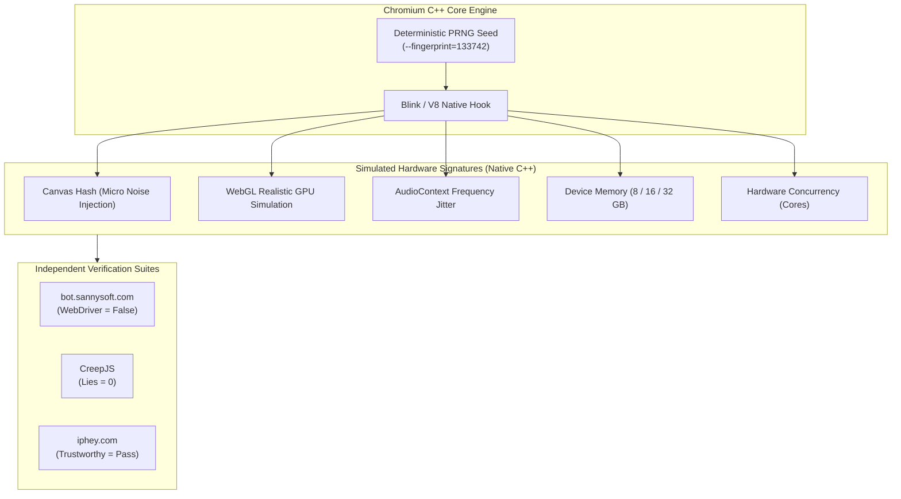

In web scraping, end-to-end automation testing, and multi-identity infrastructure, bypassing modern bot detection platforms (such as Cloudflare Turnstile, DataDome, Kasada, or Akamai Bot Manager) is an ongoing engineering challenge.

Most conventional stealth techniques inject JavaScript shims into Puppeteer or Playwright (`puppeteer-extra-plugin-stealth`). However, advanced anti-bot engines readily detect these interventions by inspecting prototype integrity (`Function.prototype.toString`, getter/setter proxies, or CreepJS Lies indicators).

This article details the architecture and practical implementation of an **Antidetect Browser** engineered by patching **Chromium at the native C++ level (Blink & V8)** combined with clean PowerShell automation.

---

## 1. Why JavaScript Injection Techniques Fail

Most stealth libraries attempt to overwrite browser attributes after document initialization or via `Page.addScriptToEvaluateOnNewDocument`:

1. **Prototype Poisoning Traps**: Using `Object.defineProperty` to mask `navigator.webdriver` or `navigator.plugins` leaves footprints. Anti-bot engines call `Object.getOwnPropertyDescriptor` or check `Function.prototype.toString()`. Any proxy wrapper immediately flags the session.
2. **Execution Timing & Race Conditions**: Inline verification scripts embedded directly in original HTML often execute before browser extension shims or user scripts can evaluate.
3. **Canvas and WebGL Noise Distortion**: Tampering with `toDataURL()` or `getImageData()` via JavaScript wrappers frequently introduces non-standard distribution artifacts that Fourier frequency analysis flags as synthetic.

The definitive solution is **patching the Chromium C++ source code (Blink and V8 Engines)** directly: every hardware fingerprint value is transformed natively before being exposed to the JavaScript runtime.

---

## 2. Core Architecture: Native C++ Interventions

### Deterministic Pseudo-Random Number Generation (PRNG)
An effective antidetect runtime does not randomize fingerprints on every page reload; it enforces **strict determinism**:
* For a given seed (`--fingerprint=<seed>`), the browser produces an identical, invariant set of hardware signatures (Canvas, WebGL, AudioContext, RAM, CPU concurrency) across all sessions.
* Changing the seed transforms the browser into an entirely different, coherent physical device.



### Identity Isolation Pillars
* **Profile Isolation**: Each workspace retains an isolated user data directory (`--user-data-dir`) separating cookies, cache, IndexedDB, and LocalStorage.
* **Stealth Automation**:
  * Native elimination of the `navigator.webdriver` flag.
  * Native support for inspecting closed Shadow DOM trees.
  * Suppression of Chrome DevTools Protocol (CDP) artifacts.
* **Realistic Hardware Topology**: WebGL parameters, GPU vendors, renderers, and shader extensions match legitimate hardware profiles for the simulated OS without unviable combinations.

---

## 3. CLI Flags Reference

Below is the standard flag reference for launching the C++ patched stealth Chromium binary:

| CLI Flag | Example Value | Architectural Purpose |
| :--- | :--- | :--- |
| **`--fingerprint=<seed>`** | `133742` *(32-bit Integer)* | **Core Seed**. Activates deterministic fingerprint perturbation (Canvas, Audio, WebGL, Fonts, RAM, CPU). |
| **`--fingerprint-platform=<os>`** | `windows`, `macos`, `linux` | Sets simulated OS platform in `navigator.platform` and Client Hints. |
| **`--fingerprint-platform-version=<ver>`** | `"10.0.0"`, `"15.2.0"` | Specifies the detailed OS version. |
| **`--fingerprint-brand=<brand>`** | `Chrome`, `Edge`, `Opera`, `Vivaldi` | Browser brand in `navigator.userAgentData`. |
| **`--fingerprint-brand-version=<ver>`** | `148.0.7778.215` | Detailed browser version string. |
| **`--fingerprint-hardware-concurrency=<n>`** | `8`, `16` | CPU core count (`navigator.hardwareConcurrency`). Derived from seed if omitted. |
| **`--timezone="<tz>"`** | `"Asia/Ho_Chi_Minh"`, `"UTC"` | Overrides C++ timezone in `Intl.DateTimeFormat` without altering host OS clock. |
| **`--lang=<locale>`** | `en-US` | Primary browser UI locale. |
| **`--accept-lang=<locales>`** | `en-US,en;q=0.9` | Language string sent via HTTP `Accept-Language` and `navigator.languages`. |
| **`--proxy-server="<proto>://<host>:<port>"`** | `socks5://127.0.0.1:1080` | Routes traffic through SOCKS5 or HTTP proxy. |
| **`--disable-non-proxied-udp`** | *(Flag)* | Prevents WebRTC STUN leaks bypassing proxy tunnels. |
| **`--disable-spoofing=<list>`** | `font,gpu` | Selectively disables spoofing modules: `font`, `audio`, `canvas`, `clientrects`, `gpu`. |
| **`--user-data-dir=<path>`** | `~/.specter/browser/profiles/p1` | Fully isolates session cookies, cache, and state. |
| **`--no-first-run`** | *(Flag)* | Bypasses initial browser setup wizard. |
| **`--no-default-browser-check`** | *(Flag)* | Disables the default browser prompt. |

---

## 4. Directory Layout (Single Source of Truth)

To organize multiple independent profiles cleanly, structure paths under a single canonical root (documented in the [Specter Dedicated Browser Runtime](https://docs.tuquet.com/en/specter/browser/)):

```text
~/.specter/browser/
├── runtimes/
│   └── stealth/                              # Native C++ patched Chromium runtime
│       ├── chrome.exe
│       ├── chrome.dll
│       └── ...
├── profiles/
│   ├── profile_01/                           # Profile 1: Seed 133742 (Direct Egress)
│   └── profile_02/                           # Profile 2: Seed 987654 (Proxy Egress)
└── scripts/
    ├── launch_profile1.ps1                   # Launch Profile 1 script
    ├── launch_profile2_proxy.ps1             # Launch Profile 2 with Proxy
    └── compare_side_by_side.ps1              # Side-by-side split screen verification
```

---

## 5. Automation Scripts via PowerShell

Below are operational PowerShell scripts for launching profiles:

### Example 1: Launch Profile 1 (Seed A, Direct Route)

```powershell
$ChromeBin = "$HOME\.specter\browser\runtimes\stealth\chrome.exe"
$ProfileDir = "$HOME\.specter\browser\profiles\profile_01"

if (-not (Test-Path -Path $ProfileDir)) {
    New-Item -ItemType Directory -Path $ProfileDir -Force | Out-Null
}

$ChromeArgs = @(
    "--user-data-dir=$ProfileDir",
    "--fingerprint=133742",
    "--fingerprint-platform=windows",
    "--fingerprint-brand=Chrome",
    "--fingerprint-brand-version=148.0.7778.215",
    "--fingerprint-hardware-concurrency=8",
    "--timezone=Asia/Ho_Chi_Minh",
    "--lang=en-US,en;q=0.9",
    "--no-first-run",
    "--no-default-browser-check",
    "https://bot.sannysoft.com"
)

Write-Host "[Stealth Browser] Launching Profile 1 (Seed: 133742)..."
Start-Process -FilePath $ChromeBin -ArgumentList $ChromeArgs
```

---

### Example 2: Launch Profile 2 (Seed B, SOCKS5 Proxy, WebRTC Leak Protection)

```powershell
$ChromeBin = "$HOME\.specter\browser\runtimes\stealth\chrome.exe"
$ProfileDir = "$HOME\.specter\browser\profiles\profile_02"

if (-not (Test-Path -Path $ProfileDir)) {
    New-Item -ItemType Directory -Path $ProfileDir -Force | Out-Null
}

$ChromeArgs = @(
    "--user-data-dir=$ProfileDir",
    "--fingerprint=987654",
    "--fingerprint-platform=windows",
    "--fingerprint-brand=Chrome",
    "--fingerprint-brand-version=148.0.7778.215",
    "--fingerprint-hardware-concurrency=16",
    "--timezone=Asia/Ho_Chi_Minh",
    "--lang=en-US,en;q=0.9",
    "--proxy-server=socks5://127.0.0.1:1080",
    "--disable-non-proxied-udp",
    "--no-first-run",
    "--no-default-browser-check",
    "https://iphey.com"
)

Write-Host "[Stealth Browser] Launching Profile 2 (Seed: 987654 | Proxy Mode)..."
Start-Process -FilePath $ChromeBin -ArgumentList $ChromeArgs
```

---

### Example 3: Side-by-Side Dual Profile Verification (`compare_side_by_side.ps1`)

Automatically opens two `960x1040` windows side by side to compare fingerprint separation:

```powershell
$ChromeBin = "$HOME\.specter\browser\runtimes\stealth\chrome.exe"
$Profile1 = "$HOME\.specter\browser\profiles\profile_01"
$Profile2 = "$HOME\.specter\browser\profiles\profile_02"
$TargetUrl = if ($args.Count -gt 0) { $args[0] } else { "https://iphey.com" }

# Window 1 (Left Half - Seed: 133742)
$Args1 = @(
    "--user-data-dir=$Profile1",
    "--fingerprint=133742",
    "--fingerprint-brand=Chrome",
    "--lang=en-US,en;q=0.9",
    "--window-position=0,0",
    "--window-size=960,1040",
    "--no-first-run",
    "--no-default-browser-check",
    $TargetUrl
)
Start-Process -FilePath $ChromeBin -ArgumentList $Args1

Start-Sleep -Seconds 2

# Window 2 (Right Half - Seed: 987654 - SOCKS5 Proxy)
$Args2 = @(
    "--user-data-dir=$Profile2",
    "--fingerprint=987654",
    "--fingerprint-brand=Chrome",
    "--lang=en-US,en;q=0.9",
    "--proxy-server=socks5://127.0.0.1:1080",
    "--disable-non-proxied-udp",
    "--window-position=960,0",
    "--window-size=960,1040",
    "--no-first-run",
    "--no-default-browser-check",
    $TargetUrl
)
Start-Process -FilePath $ChromeBin -ArgumentList $Args2
```

---

## 6. Verification Results Across Anti-Bot Suites

Empirical verification results from side-by-side execution:

| Test Target | Window 1 (Seed `133742` - Direct) | Window 2 (Seed `987654` - Proxy) | Architectural Significance |
| :--- | :--- | :--- | :--- |
| **IP Egress (`iphey.com`)** | `198.51.100.24` *(Direct)* | `203.0.113.88` *(Dedicated Proxy)* | ✅ **Strict IP isolation, no STUN leakage** |
| **Iphey Trust Status** | Trustworthy: **Pass** | Trustworthy: **Pass** | ✅ **Passes behavioral heuristic tests** |
| **`navigator.webdriver`** | `false` *(Green)* | `false` *(Green)* | ✅ **Automation flag eliminated at source** |
| **Canvas Signature Hash** | Hash A *(Unique)* | Hash B *(Unique)* | ✅ **Deterministic noise distribution** |
| **WebGL Renderer** | Simulated GPU Spec A | Simulated GPU Spec B | ✅ **Consistent OS hardware pairing** |
| **CreepJS Lies Count** | **`0 Lies`** | **`0 Lies`** | ✅ **Zero prototype poisoning indicators** |
| **Device Memory (`deviceMemory`)**| 16 GB | 32 GB | ✅ **Plausible memory allocation** |
| **Determinism Across Restarts**| Identical Hash every launch | Identical Hash every launch | ✅ **Zero unexpected variance** |

---

## 7. Core Operational Guardrails

1. **Strict Identity-to-Seed Binding**: Bind each account to a dedicated `--fingerprint` seed permanently. Mutating seeds between sessions resembles an abrupt physical hardware swap, which triggers security reviews.
2. **Geographic & Locale Consistency**: When routing through a specific regional proxy, synchronize `--lang` and `--timezone` accordingly to avoid Geo-IP mismatch flags.
3. **Always Enforce `--disable-non-proxied-udp` on Proxy Sessions**: WebRTC STUN queries can bypass HTTP/SOCKS5 proxies over UDP. This flag ensures local real IP addresses are never exposed.
