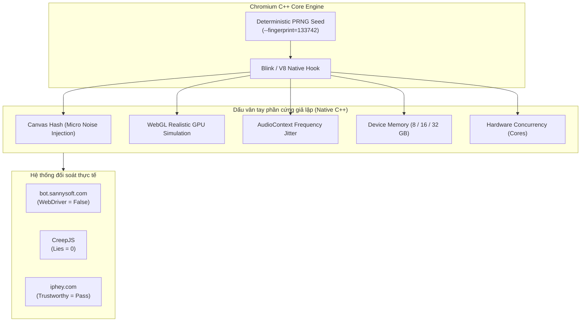

Trong thế giới thu thập dữ liệu web (Web Scraping), tự động hóa kiểm thử (E2E Testing) và quản lý danh tính số (Multi-Accounting), một trong những thách thức lớn nhất là vượt qua các hệ thống phát hiện bot hiện đại như Cloudflare Turnstile, DataDome, Kasada hay Akamai Bot Manager.

Hầu hết các giải pháp truyền thống như tiêm script vào Puppeteer/Playwright (`puppeteer-extra-plugin-stealth`) đều can thiệp ở **tầng JavaScript**. Các hệ thống chống bot cao cấp dễ dàng phát hiện các thủ thuật này thông qua việc kiểm tra tính toàn vẹn của prototype (`Function.prototype.toString`, getter/setter proxies, hay điểm số Lies trên CreepJS).

Bài viết này tổng hợp kiến trúc kỹ thuật và hướng dẫn thực hành xây dựng một **Trình duyệt ẩn danh (Antidetect Browser)** chuyên nghiệp thông qua việc can thiệp trực tiếp ở **tầng C++ (Native Chromium)** kết hợp tự động hóa kịch bản bằng PowerShell.

---

## 1. Tại sao giải pháp can thiệp JavaScript đều bị lật tẩy?

Hầu hết các thư viện stealth hiện nay cố gắng ghi đè các thuộc tính trình duyệt sau khi trang web đã nạp hoặc trong sự kiện `Page.addScriptToEvaluateOnNewDocument`:

1. **Bẫy Prototype Poisoning**: Khi bạn dùng `Object.defineProperty` để ghi đè `navigator.webdriver` hay `navigator.plugins`, hàm kiểm thử của hệ thống Anti-bot sẽ gọi `Object.getOwnPropertyDescriptor` hoặc kiểm tra chuỗi hàm `Function.prototype.toString()`. Bất kỳ dấu hiệu proxy nào cũng lập tức bị gắn cờ "Lies" (Dối trá).
2. **Thứ tự thực thi (Race Conditions)**: Một số script chống bot được nhúng trực tiếp trong HTML gốc và chạy trước cả khi extension hay script inject của bạn kịp thực thi.
3. **Độ lệch ngữ cảnh Canvas và WebGL**: Việc can thiệp dữ liệu hình ảnh trả về từ hàm `toDataURL()` hay `getImageData()` bằng JavaScript thường tạo ra các vết nhiễu bất thường, dễ bị phát hiện bởi các thuật toán phân tích phổ tần (Fourier Analysis).

Giải pháp triệt để duy nhất là **vá trực tiếp mã nguồn C++ của Chromium (Blink & V8 Engine)**: mọi giá trị vân tay được tính toán và biến đổi ở tầng native trước khi phơi bày ra môi trường JavaScript.

---

## 2. Kiến trúc cốt lõi: Can thiệp tầng Native C++

### Nguyên lý tạo nhiễu xác định (Deterministic PRNG)
Một trình duyệt ẩn danh tốt không phải là trình duyệt ngẫu hóa thông số liên tục qua mỗi lần tải trang, mà phải đảm bảo tính **nhất quán (Determinism)**:
* Cùng một số hạt giống (`--fingerprint=<seed>`), trình duyệt sẽ luôn trả về một bộ dấu vân tay phần cứng (Canvas, WebGL, Audio, RAM, CPU) **duy nhất và cố định** qua mọi phiên làm việc.
* Khi thay đổi seed, trình duyệt sẽ biến thành một thiết bị phần cứng hoàn toàn khác.



### Các trụ cột bảo vệ danh tính
* **Cô lập không gian lưu trữ (Profile Isolation)**: Mỗi tài khoản sở hữu thư mục dữ liệu (`--user-data-dir`) hoàn toàn độc lập về Cookies, Cache, IndexedDB và LocalStorage.
* **Tự động hóa an toàn (Stealth Automation)**:
  * Tự động vô hiệu hóa cờ `navigator.webdriver`.
  * Hỗ trợ trích xuất nội dung Closed Shadow DOM an toàn.
  * Ẩn các dấu hiệu can thiệp Chrome DevTools Protocol (CDP).
* **Mô phỏng phần cứng thực tế (Realistic Simulation)**: Tham số WebGL, GPU vendor, renderer và shader extensions khớp hoàn hảo với hệ điều hành đang giả lập, không tạo ra các tổ hợp phần cứng phi logic.

---

## 3. Bảng tra cứu toàn diện các cờ dòng lệnh CLI (Flags Reference)

Dưới đây là danh mục cờ dòng lệnh chuẩn mực để khởi chạy trình duyệt nhân C++ đã vá vân tay:

| Cờ dòng lệnh (CLI Flags) | Giá trị mẫu | Ý nghĩa & Tác dụng kiến trúc |
| :--- | :--- | :--- |
| **`--fingerprint=<seed>`** | `133742` *(Số nguyên 32-bit)* | **Hạt giống cốt lõi**. Kích hoạt toàn bộ thuật toán tạo nhiễu vân tay (Canvas, Audio, WebGL, Fonts, RAM, CPU). |
| **`--fingerprint-platform=<os>`** | `windows`, `macos`, `linux` | Định danh hệ điều hành mục tiêu trong `navigator.platform` và Client Hints. |
| **`--fingerprint-platform-version=<ver>`** | `"10.0.0"`, `"15.2.0"` | Phiên bản chi tiết của hệ điều hành được mô phỏng. |
| **`--fingerprint-brand=<brand>`** | `Chrome`, `Edge`, `Opera`, `Vivaldi` | Thương hiệu trình duyệt trong `navigator.userAgentData`. |
| **`--fingerprint-brand-version=<ver>`** | `148.0.7778.215` | Phiên bản chi tiết của thương hiệu trình duyệt. |
| **`--fingerprint-hardware-concurrency=<n>`** | `8`, `16` | Số nhân CPU (`navigator.hardwareConcurrency`). Tự sinh theo seed nếu để trống. |
| **`--timezone="<tz>"`** | `"Asia/Ho_Chi_Minh"`, `"UTC"` | Can thiệp múi giờ tầng C++ `Intl.DateTimeFormat` mà **không cần đổi giờ máy host**. |
| **`--lang=<locale>`** | `vi-VN` | Ngôn ngữ giao diện chính của trình duyệt. |
| **`--accept-lang=<locales>`** | `vi-VN,vi,en-US,en` | Danh sách ngôn ngữ gửi qua HTTP Header `Accept-Language` và `navigator.languages`. |
| **`--proxy-server="<proto>://<host>:<port>"`** | `socks5://127.0.0.1:1080` | Định tuyến toàn bộ lưu lượng qua SOCKS5 hoặc HTTP Proxy. |
| **`--disable-non-proxied-udp`** | *(Không tham số)* | Ngăn chặn rò rỉ địa chỉ IP thật qua giao thức WebRTC STUN khi sử dụng Proxy. |
| **`--disable-spoofing=<list>`** | `font,gpu` | Tắt có chọn lọc một số thành phần can thiệp: `font`, `audio`, `canvas`, `clientrects`, `gpu`. |
| **`--user-data-dir=<path>`** | `~/.specter/browser/profiles/p1` | Cách ly hoàn toàn cookies, cache, local storage giữa các profile. |
| **`--no-first-run`** | *(Không tham số)* | Bỏ qua màn hình thiết lập lần đầu. |
| **`--no-default-browser-check`** | *(Không tham số)* | Tắt thông báo nhắc đặt trình duyệt mặc định. |

---

## 4. Cấu trúc thư mục chuẩn mực (SSOT Layout)

Để quản lý hàng chục hoặc hàng trăm profile mà không bị lẫn lộn dữ liệu, cấu trúc thư mục nên được quy hoạch tập trung theo nguyên tắc Single Source of Truth:

```text
~/.specter/browser/
├── runtimes/
│   └── stealth/                              # Thư mục nhân Chromium vá C++
│       ├── chrome.exe
│       ├── chrome.dll
│       └── ...
├── profiles/
│   ├── profile_01/                           # Profile 1: Seed 133742 (IP Trực tiếp)
│   └── profile_02/                           # Profile 2: Seed 987654 (Proxy Egress)
└── scripts/
    ├── launch_profile1.ps1                   # Kịch bản khởi chạy Profile 1
    ├── launch_profile2_proxy.ps1             # Kịch bản khởi chạy Profile 2
    └── compare_side_by_side.ps1              # Kịch bản chia đôi màn hình đối chiếu
```

---

## 5. Kịch bản thực chiến qua PowerShell

Dưới đây là các kịch bản thực tế điều khiển trình duyệt ẩn danh bằng PowerShell (`powershell.exe`):

### Ví dụ 1: Khởi chạy Profile 1 (Hạt giống A, IP Trực tiếp)

```powershell
$ChromeBin = "$HOME\.specter\browser\runtimes\stealth\chrome.exe"
$ProfileDir = "$HOME\.specter\browser\profiles\profile_01"

if (-not (Test-Path -Path $ProfileDir)) {
    New-Item -ItemType Directory -Path $ProfileDir -Force | Out-Null
}

$ChromeArgs = @(
    "--user-data-dir=$ProfileDir",
    "--fingerprint=133742",
    "--fingerprint-platform=windows",
    "--fingerprint-brand=Chrome",
    "--fingerprint-brand-version=148.0.7778.215",
    "--fingerprint-hardware-concurrency=8",
    "--timezone=Asia/Ho_Chi_Minh",
    "--lang=vi-VN,vi,en-US,en",
    "--no-first-run",
    "--no-default-browser-check",
    "https://bot.sannysoft.com"
)

Write-Host "[Stealth Browser] Launching Profile 1 (Seed: 133742)..."
Start-Process -FilePath $ChromeBin -ArgumentList $ChromeArgs
```

---

### Ví dụ 2: Khởi chạy Profile 2 (Hạt giống B, Proxy SOCKS5, Chống WebRTC Leak)

```powershell
$ChromeBin = "$HOME\.specter\browser\runtimes\stealth\chrome.exe"
$ProfileDir = "$HOME\.specter\browser\profiles\profile_02"

if (-not (Test-Path -Path $ProfileDir)) {
    New-Item -ItemType Directory -Path $ProfileDir -Force | Out-Null
}

$ChromeArgs = @(
    "--user-data-dir=$ProfileDir",
    "--fingerprint=987654",
    "--fingerprint-platform=windows",
    "--fingerprint-brand=Chrome",
    "--fingerprint-brand-version=148.0.7778.215",
    "--fingerprint-hardware-concurrency=16",
    "--timezone=Asia/Ho_Chi_Minh",
    "--lang=vi-VN,vi,en-US,en",
    "--proxy-server=socks5://127.0.0.1:1080",
    "--disable-non-proxied-udp",
    "--no-first-run",
    "--no-default-browser-check",
    "https://iphey.com"
)

Write-Host "[Stealth Browser] Launching Profile 2 (Seed: 987654 | Proxy Mode)..."
Start-Process -FilePath $ChromeBin -ArgumentList $ChromeArgs
```

---

### Ví dụ 3: Kịch bản mở song song chia đôi màn hình để đối chiếu (`compare_side_by_side.ps1`)

Kịch bản tự động mở 2 cửa sổ với kích thước `960x1040` đặt cạnh nhau để kiểm tra tính độc lập của 2 danh tính:

```powershell
$ChromeBin = "$HOME\.specter\browser\runtimes\stealth\chrome.exe"
$Profile1 = "$HOME\.specter\browser\profiles\profile_01"
$Profile2 = "$HOME\.specter\browser\profiles\profile_02"
$TargetUrl = if ($args.Count -gt 0) { $args[0] } else { "https://iphey.com" }

# Cửa sổ 1 (Nửa trái màn hình - Seed: 133742)
$Args1 = @(
    "--user-data-dir=$Profile1",
    "--fingerprint=133742",
    "--fingerprint-brand=Chrome",
    "--lang=vi-VN,vi,en-US,en",
    "--window-position=0,0",
    "--window-size=960,1040",
    "--no-first-run",
    "--no-default-browser-check",
    $TargetUrl
)
Start-Process -FilePath $ChromeBin -ArgumentList $Args1

Start-Sleep -Seconds 2

# Cửa sổ 2 (Nửa phải màn hình - Seed: 987654 - Proxy SOCKS5)
$Args2 = @(
    "--user-data-dir=$Profile2",
    "--fingerprint=987654",
    "--fingerprint-brand=Chrome",
    "--lang=vi-VN,vi,en-US,en",
    "--proxy-server=socks5://127.0.0.1:1080",
    "--disable-non-proxied-udp",
    "--window-position=960,0",
    "--window-size=960,1040",
    "--no-first-run",
    "--no-default-browser-check",
    $TargetUrl
)
Start-Process -FilePath $ChromeBin -ArgumentList $Args2
```

---

## 6. Kết quả đối soát thực tế trên các hệ thống Anti-Bot

Dưới đây là bảng đối soát thực nghiệm thu thập từ 2 phiên trình duyệt chạy song song:

| Hạng mục kiểm tra | Cửa sổ 1 (Seed `133742` - Direct) | Cửa sổ 2 (Seed `987654` - Proxy) | Ý nghĩa kỹ thuật |
| :--- | :--- | :--- | :--- |
| **Định tuyến IP (`iphey.com`)** | `198.51.100.24` *(Residential IP)* | `203.0.113.88` *(Dedicated Proxy)* | ✅ **Cách ly IP hoàn toàn, không rò rỉ STUN** |
| **Trạng thái Iphey** | Trustworthy: **Pass** | Trustworthy: **Pass** | ✅ **Vượt qua thuật toán kiểm tra danh tính** |
| **`navigator.webdriver`** | `false` *(Màu xanh lá)* | `false` *(Màu xanh lá)* | ✅ **Loại bỏ hoàn toàn cờ nhận diện tự động** |
| **Canvas Signature Hash** | Hash A *(độc bản)* | Hash B *(độc bản)* | ✅ **Nhiễu phân bố ngẫu nhiên và ổn định** |
| **WebGL Renderer** | Mô phỏng GPU cấu hình A | Mô phỏng GPU cấu hình B | ✅ **Khớp logic phần cứng hệ điều hành** |
| **CreepJS Lies Count** | **`0 Lies`** | **`0 Lies`** | ✅ **Không dính bẫy Prototype Poisoning** |
| **Bộ nhớ RAM (`deviceMemory`)** | Tự sinh (16 GB) | Tự sinh (32 GB) | ✅ **Ngẫu hóa dung lượng RAM hợp lý** |
| **Tính Nhất Quán (Determinism)**| Giữ nguyên Hash qua mọi lần mở | Giữ nguyên Hash qua mọi lần mở | ✅ **Không tạo biến thiên bất thường** |

---

## 7. Ba nguyên tắc vàng khi vận hành danh tính số

1. **Khóa chặt Seed cho từng tài khoản (Identity Binding)**: Mỗi tài khoản chỉ gắn liền với duy nhất 1 số hạt giống `--fingerprint`. Việc thay đổi seed giữa chừng tương đương với hành động đột ngột thay đổi toàn bộ linh kiện phần cứng máy tính, rất dễ khiến hệ thống an ninh kích hoạt bước xác minh danh tính.
2. **Nhất quán giữa Vị trí Địa lý và Ngôn ngữ**: Nếu sử dụng Proxy tại Việt Nam, hãy đặt `--lang=vi-VN,vi,en-US,en` và `--timezone=Asia/Ho_Chi_Minh`. Nếu IP đặt tại Nhật Bản, hãy điều chỉnh `--lang=ja-JP,ja,en-US,en` và `--timezone=Asia/Tokyo` để tránh cờ lệch vị trí địa lý (Geo-IP Mismatch).
3. **Luôn bật `--disable-non-proxied-udp` khi sử dụng Proxy**: Giao thức WebRTC có thể gửi các gói tin STUN qua kết nối trực tiếp bỏ qua proxy HTTP/SOCKS5. Cờ này là lá chắn bắt buộc để bảo vệ IP gốc của bạn không bị lộ.
